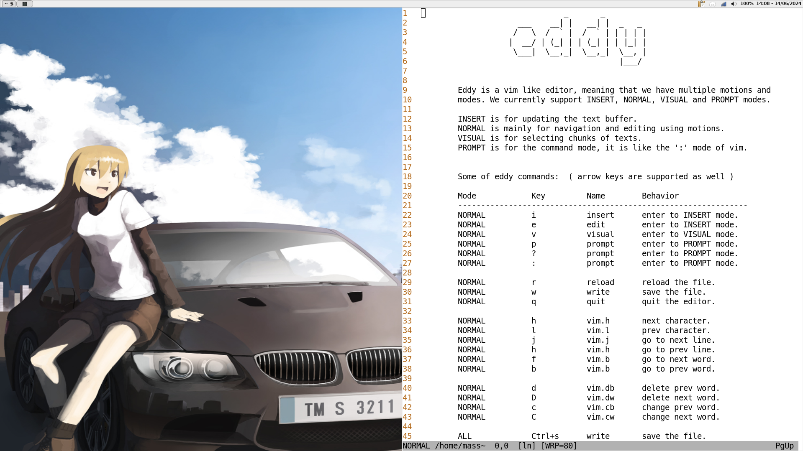

# Eddy - A minimal text editor


## Motivation & Aims

Eddy was a small project that helped me learn more about how games work. I wanted to explore this realm, and since I love text editors 
( I use vim btw ), I thought it would be great to create one.

**But why creating a text editor to learn how games work ?** Well they are very similar, basically you have a setup function that prepares 
everything that the program/interface might need as resources, then you'll have the main loop in which you catch user input and update
the current state (update & rerendering). 

So that is why a text editor is not much diffrent then a game. You draw the editor interface, you enter your main loop, you listen for
user input and you redraw to the screen the updated state.

## Screenshot

- Eddy v0.1.0 screenshot, ( a very minimal editor, not designed for mainstream use, only experimental )




## Setup & Installation ( Using Go tools )

```sh

    # make sure to install figlet (for some use these commands)
    [[ "$HOSTNAME" == "debian" ]] && sudo apt install figlet
    [[ "$HOSTNAME" == "ubuntu" ]] && sudo apt install figlet
    [[ "$HOSTNAME" == "fedora" ]] && sudo dnf install figlet


    # build the binary (this requires Go to be installed )
    make build

    # setup the environment and mv the binary to ~/.local/share
    make install

    # (Optional) you can create a symlink to the binary
    # to /usr/local/bin, or directly copy the binary to it.

```

## Setup & Installation ( Without Go tools )

First, download from Github the latest release. 

```sh

    # clone the repo
    git clone <repo_url>

    # download from github the latest release

    # move the binary of the release to the project /bin directory

    # run make install 
    make install

```


## Uninstall 

```sh

    # just run the following command to remove all the used
    # directroies and the ~/.local/share binary.
    make uninstall

    # (NOTE) extra setup from your part should be undone by
    # yourself.

```