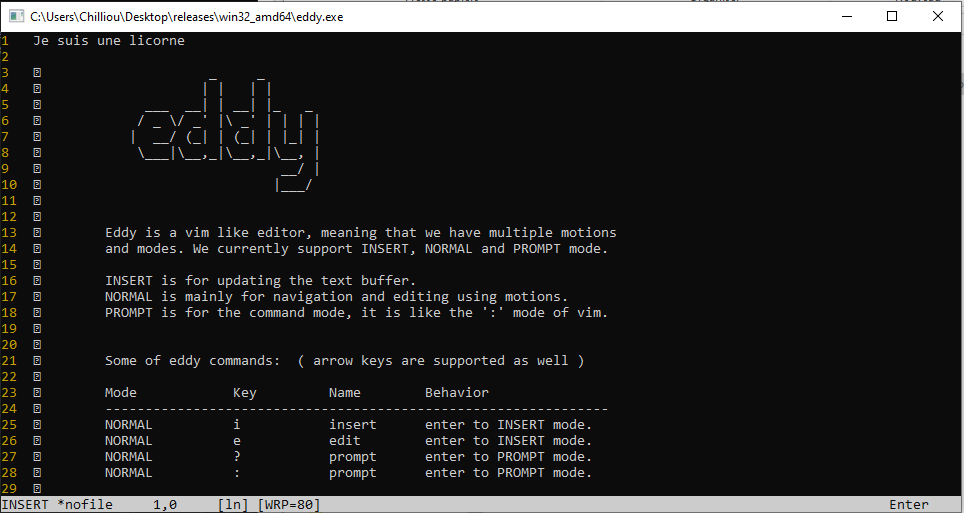

# Eddy - A minimal text editor

## Motivation & Aims

Eddy was a small project that helped me learn more about how games work. I wanted to explore this realm, and since I love text editors 
( I use vim btw ), I thought it would be great to create one.

**But why creating a text editor to learn how games work ?** Well they are very similar, basically you have a setup function that prepares 
everything that the program/interface might need as resources, then you'll have the main loop in which you catch user input and update
the current state (update & rerendering). 

So that is why a text editor is not much diffrent then a game. You draw the editor interface, you enter your main loop, you listen for
user input and you redraw to the screen the updated state.

## Screenshot

- Eddy v0.2.x screenshot, ( a very minimal editor, not designed for mainstream use, only experimental )

*Linux*

---

*Windows*

---

*Prompt mode*

---

## Setup & Installation ( Without Go tools )

- First, download from Github the latest release. 
    - for Linux and OSX(MAC), download the eddy binary.
    - for Windows, download the eddy.exe binary.
- Verify the download integrity using the checksums (checklist.chk).
- Add it to your PATH env variable, and run it.

**NOTE:** For those of you that are using windows, it would be better to use MS-Powershell/Git-Bash instead of DOS-CMD, since Powershell has a better support for POSIX commands (the makefile will run better on it).

## Uninstall

- Delete the binary file.
- Remove the binary from your PATH env variable.

## Setup & Installation ( With Go tools )

For this, you can either keep the project free from CGO and use 
the Makefile. Or, you can introduce CGO and use `zig cc` or 
`zig c++` to compile and include/pass C/C++ libraries to the 
clang compiler, to do so you'll have to change the Makefile to update the `CC` env before calling `go build`.

If you do not want to use the Makefile, you can use `goreleaser` that prefers yaml files which are easier to read and maintain. 
Be aware though that `goreleaser` set `CGO_ENABLED=0` by default. This won't be an issue if the projects still is CGO-free but consider changing that config if that is no longer the case.
